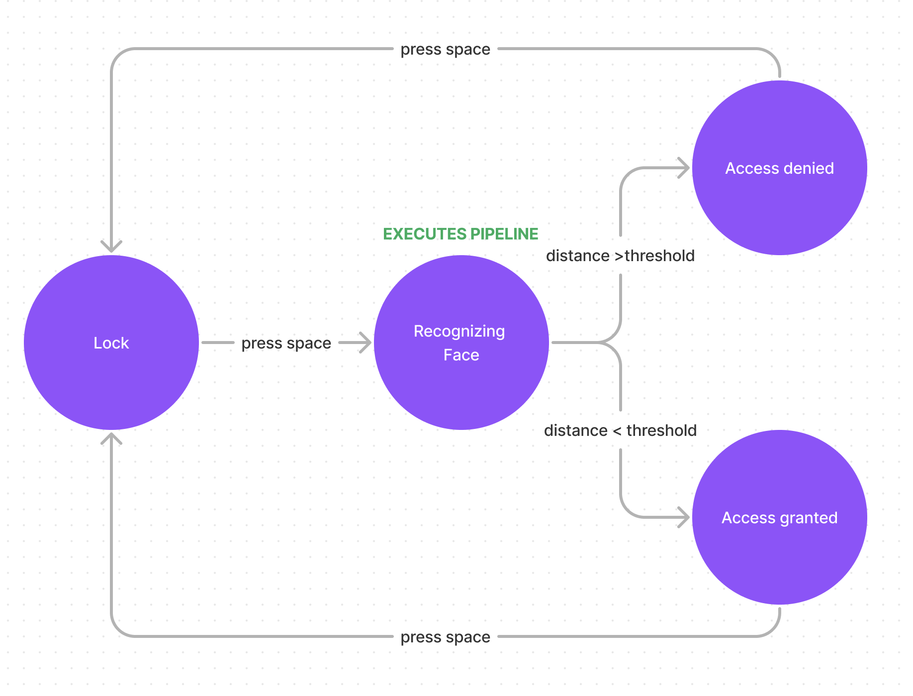

# PRACTICA 6 DE VC

Para estra práctica había que buscar posibles aplicaciones en el uso de deepface, combinado con varios de los detectores de cara que habíamos usado en anteriores prácticas como Viola-Jones.

Nosotros hemos decidido hacer dos propuestas. La primera una aplicación que muestre una interfaz sobre la cara detectada ofreciendo datos de la edad, sexo y emociones experimentadas por esa persona en tiempo real.

La segunda propuesta ha sido crear un mecanismo de autentificación facial donde solo permita el acceso al sistema a aquellas personas autorizadas.

Tabmién cabe destacar que el código se ha desarrollado teniendo en cuenta los principios de ingenieria de software mas importantes y sus fundamentos. Por lo tanto el código escrito es extensible, modular, fácil de mantener y de escalar.

# Propuesta 1

## Fase de diseño de producto

El diseño de esta propuesta se realizo primeramente en Figma para comprobar si eramos capaces de crear una interfaz que pudiera mostrarse correctamente en la cámara con la información requerida. Tras varias iteraciones acabamos con el siguiente diseño.


## Fase de diseño del pipeline

Para realizar el proyecto hemos decidido optar primero por la creación del pipeline que vamos a necesitar para lograr el resultado esperado y las difernetes interfaces que representan cada step dentro del pipeline.

El pipeline sería el siguiente.


Como podemos observar consta de tres fases
- FaceDetector: es el encargado de realizar la detección de la cara dentro del frame extraido de la camara
- FaceQualifier: es el encargado de extraer toda la información de la persona que necesitamos y devuelve una instancia de una clase Person
- FaceDisplay: recibe toda la información de la persona y pinta la UI en pantalla.

Como hemos podido comprobar en los resultados las fases han sido consistentes y nos han permitido abordar la práctica con éxito.

## Fase de diseño de software

### Modelo

Respecto al diseño de software lo primero que hemos echo es definir nuestro modelo. Conjunto de clases que van a representar la información que necesitamos a lo largo de nuestro flujo y a su vez servirán de contrato entre las diferentes steps del pipeline.


```python
@dataclass
class Emotions:
    name : str
    quantity : int

@dataclass
class Point:
    x : float
    y : float

@dataclass
class BoundingBox:
    origin : Point
    end: Point


class Genre:
    male = 'Man'
    female = 'Woman'

    def __init__(self, genre : str):
        self.genre = genre

    @staticmethod
    def female():
        return Genre(Genre.female)
    
    @staticmethod
    def male():
        return Genre(Genre.male)
    
    def isMale(self):
        return self.genre == Genre.male

    def isFemale(self):
        return self.genre == Genre.female

@dataclass
class Person:
    age : str
    genre : Genre
    emotions : List[Emotions]
    bounding_box : BoundingBox
    image : np.ndarray

@dataclass
class FaceDetectorResult:
    image : np.ndarray 
    bounding_box : BoundingBox
```

### Aplicación

Lo siguiente que hemos creado es la capa de aplicación donde se encuentran las diferentes interfaces que necesitamos para ejecutar el pipeline de forma funcional.

```python

class FaceDetector(ABC):
    @abstractmethod
    def detect(self, image : np.ndarray) -> List[FaceDetectorResult]:
        pass

class FaceQualifier(ABC):
    @abstractmethod
    def qualify(self, face_detector_result : FaceDetectorResult) -> Person:
        pass

class FaceQualificationDisplay:
    def show():
        pass
```

Como vemos todas estan tipadas y queda claro cuales son las entradas y salidas de cada fase. De esta forma las tratamos como cajas negras que podran permitirse multiples implementaciones y sustituciones en un futuro.


### Infraestructura

En esta capa hemos realizado varias implementaciones de cada una de steps del pipeline. Mostremos cada una de ellas.

#### FaceDetector

Encargada de recibir un frame y devolver una detección de una cara. Hemos implementado ViolaJones, RetinaFace y Mediapipe.


ViolaJones

```python
class ViolaJonesFaceDetector(FaceDetector):
    cascPathface = os.path.dirname(
        cv2.__file__) + "/data/haarcascade_frontalface_alt2.xml"

    def detect(self, image : np.ndarray) -> List[FaceDetectorResult]:
        faceCascade = cv2.CascadeClassifier(self.cascPathface)
        gray = self._convert_image_to_gray(image)
        faces = faceCascade.detectMultiScale(gray,
                                         scaleFactor=1.1,
                                         minNeighbors=5,
                                         minSize=(60, 60),
                                         flags=cv2.CASCADE_SCALE_IMAGE)
        return self._convert_to_face_detector_result(image, faces)
        
    
    def _convert_to_face_detector_result(self, image, faces) -> List[FaceDetectorResult]:
        bounding_boxes = [BoundingBox(Point(x, y), Point(x+w, y+h)) for (x, y, w, h) in faces]
        return [FaceDetectorResult(ImageUtils.crop(image, bounding_box), bounding_box) for bounding_box in bounding_boxes]
    
    def _convert_image_to_gray(self, image : np.ndarray) -> np.ndarray:
        import cv2
        return cv2.cvtColor(image, cv2.COLOR_BGR2GRAY)

Retina face

```python
class RetinafaceFaceDetector(FaceDetector):
    def detect(self, image : np.ndarray) -> List[FaceDetectorResult]:
        faces = RetinaFace.detect_faces(image);
        return self._convert_to_face_detector_result(image, [faces[key]['facial_area'] for key in faces.keys()])
    
    def _convert_to_face_detector_result(self, image, faces) -> List[FaceDetectorResult]:
        bounding_boxes = [BoundingBox(Point(x, y), Point(w, h)) for (x, y, w, h) in faces]
        return [FaceDetectorResult(ImageUtils.crop(image, bounding_box), bounding_box) for bounding_box in bounding_boxes]

MediaPipe

```python
class MediaPipeFaceDetector(FaceDetector):
    def detect(self, image : np.ndarray) -> List[FaceDetectorResult]:
        BaseOptions = mp.tasks.BaseOptions
        FaceDetector = mp.tasks.vision.FaceDetector
        FaceDetectorOptions = mp.tasks.vision.FaceDetectorOptions
        VisionRunningMode = mp.tasks.vision.RunningMode

        options = FaceDetectorOptions(
            base_options=BaseOptions(model_asset_path='./blaze_face_short_range.tflite'),
            running_mode=VisionRunningMode.IMAGE)

        with FaceDetector.create_from_options(options) as detector:
            mp_image = mp.Image(image_format=mp.ImageFormat.SRGB, data=image)
            face_detector_result = detector.detect(mp_image)
            return self._convert_to_face_detector_result(image, [(x.bounding_box.origin_x, x.bounding_box.origin_y, x.bounding_box.width, x.bounding_box.height) for x in face_detector_result.detections])
        
    def _convert_to_face_detector_result(self, image, faces) -> List[FaceDetectorResult]:
        bounding_boxes = [BoundingBox(Point(x, y), Point(x + w, y + h)) for (x, y, w, h) in faces]
        return [FaceDetectorResult(ImageUtils.crop(image, bounding_box), bounding_box) for bounding_box in bounding_boxes]
```


Para esta aplicación hemos decidido quedarnos con Mediapipe debido a que tiene un buen promedio velocidad y calidad de la detección. Si bien el más lento y fiable es RetinaFace no servía para el uso en tiempo real y ViolaJones aunque rápido sabemos que falla con caras giradas o en perspectivas no frontales.

#### FaceQualifier

Este es el encargado de extraer la información de la cara de la detección antes realizada.
Como en la práctica solo nos pedían usar deepface hemos realizado una única implementación con este. Sin embargo en un futuro se podría usar cualquier alternativa sin afectar a la ejecución del programa.

```python
from deepface import DeepFace

class DeepfaceFaceQualifier(FaceQualifier):
    def qualify(self, face_detector_result: FaceDetectorResult) -> Person:
        face_image = face_detector_result.image
        deepface_result = DeepFace.analyze(img_path = face_image, actions = ['age', 'gender', 'emotion'], enforce_detection=False)[0]
        
        age = str(deepface_result["age"])
        gender = Genre(max(deepface_result["gender"], key = deepface_result["gender"].get))
        emotion_predictions = deepface_result["emotion"]
        emotions = [Emotions(name=emotion, quantity=round(probability, 3)) for emotion, probability in emotion_predictions.items()]
        sorted_emotions = sorted(emotions, key=lambda x: x.quantity, reverse=True)

        person = Person(
            age = age,
            genre = gender,
            emotions = sorted_emotions[0:3],
            bounding_box = face_detector_result.bounding_box,
            image = face_image
        )
        
        return person
```

#### FaceDisplay

Al igual que el anterior hemos echo una única implementación de la interfaz usando OpenCV. En un futuro si quisieramos cambiar la "Skin" podríamos simplemente hacer otra implementación del display y hacerlo como queramos.

```python
import cv2 as cv

class OpenCVFaceQualificationDisplay(FaceQualificationDisplay):
    def __init__(self, people : List[Person], frame : np.ndarray) -> None:
        self.people = people
        self.frame = frame
    
    def display_emotions_right_of_person(self, person: Person, padding_x: int, padding_y: int) -> None:
        width = 200
        border_width =2
        rectangle_origin = (person.bounding_box.end.x + border_width, person.bounding_box.origin.y - border_width)
        rectangle_end = (rectangle_origin[0] + width, person.bounding_box.end.y + border_width)
        if rectangle_end[0] > self.frame.shape[1]:
            rectangle_end = (self.frame.shape[1], rectangle_end[1])
        if rectangle_end[1] > self.frame.shape[0]:
            rectangle_end = (rectangle_end[0], self.frame.shape[0])
        #blur the rectangle background
        self.frame[rectangle_origin[1]:rectangle_end[1], rectangle_origin[0]:rectangle_end[0]] = cv.GaussianBlur(self.frame[rectangle_origin[1]:rectangle_end[1], rectangle_origin[0]:rectangle_end[0]], (75, 75), 0) / 1.5

        font_weight=1
        font_size=0.8
        text = "Emotions"
        text_size, _ = cv.getTextSize(text, cv.FONT_HERSHEY_DUPLEX, font_size, font_weight)
        text_width, text_height = text_size
        text_x = rectangle_origin[0] + (rectangle_end[0] - rectangle_origin[0]) // 2 - text_width // 2
        text_y = rectangle_origin[1] + text_height + padding_y // 2
        cv.putText(self.frame, text, (text_x, text_y), cv.FONT_HERSHEY_DUPLEX, font_size, (255, 255, 255), font_weight, lineType = cv2.LINE_AA)

        gap = 40

        for x in person.emotions:
            #draw text of emotion
            font_weight=1
            font_size=0.5
            text = x.name + ": " + str(x.quantity)
            text_size, _ = cv.getTextSize(text, cv.FONT_HERSHEY_DUPLEX, font_size, font_weight)
            text_width, text_height = text_size
            text_x = rectangle_origin[0] + (rectangle_end[0] - rectangle_origin[0]) // 2 - text_width // 2
            text_y = (rectangle_origin[1] + text_height + padding_y // 2) + gap
            cv.putText(self.frame, text, (text_x, text_y), cv.FONT_HERSHEY_DUPLEX, font_size, (255, 255, 255), font_weight, lineType = cv2.LINE_AA)
            gap+=30


    def display_age_on_top_of_person(self, person: Person, padding_x: int, padding_y: int) -> None:
        gap = 26
        font_thinkness = 2
        icon_size = 38
        triangle_size = 20

        text = str(person.age)
        text_size, _ = cv.getTextSize(text, cv.FONT_HERSHEY_DUPLEX, 1.5, font_thinkness)
        text_width, text_height = text_size

        rectangle_origin = ((person.bounding_box.origin.x + (person.bounding_box.end.x - person.bounding_box.origin.x) // 2 - (text_width + padding_x) // 2), person.bounding_box.origin.y - text_height - padding_y - 50)
        rectangle_end = (rectangle_origin[0] + text_width + padding_x, rectangle_origin[1] + text_height + padding_y)

        # Draw the rectangle with a pointer
        cv.rectangle(self.frame, rectangle_origin, rectangle_end, (67, 193, 246), cv.FILLED)

        # Center the text within the rectangle
        text_x = rectangle_origin[0] + (rectangle_end[0] - rectangle_origin[0]) // 2 - text_width // 2
        text_y = rectangle_origin[1] + text_height + padding_y // 2

        # Draw the text
        cv.putText(self.frame, text, (text_x - gap, text_y), cv.FONT_HERSHEY_DUPLEX, 1.5, (47, 123, 222), font_thinkness, lineType = cv2.LINE_AA)

        triangle = np.array([[rectangle_origin[0] + (rectangle_end[0] - rectangle_origin[0]) // 2 - triangle_size + 5, rectangle_end[1]],
                            [rectangle_origin[0] + (rectangle_end[0] - rectangle_origin[0]) // 2 + triangle_size - 5, rectangle_end[1]],
                            [rectangle_origin[0] + (rectangle_end[0] - rectangle_origin[0]) // 2, rectangle_end[1] + triangle_size] ], np.int32)
        
        cv.drawContours(self.frame, [triangle], 0, (67, 193, 246), cv.FILLED)

        male_icon = cv.imread("./assets/male.png" if person.genre.isMale() else "./assets/female.png")  # Correct the path to your male icon image
        if male_icon is not None:
            male_icon = cv.resize(male_icon, (icon_size, icon_size))
            rectangle_center = (rectangle_origin[0] + (rectangle_end[0] - rectangle_origin[0]) // 2, rectangle_origin[1] + icon_size // 2 + padding_y//2)
            self.overlay_icon(male_icon, (rectangle_center[0] + gap, rectangle_center[1]))
        else:
            print("Male icon not found or there's an error in reading the image.")
    
    def overlay_icon(self, icon, center):
        """Overlay an icon image at the specified top left corner position."""
        h, w, _ = icon.shape
        x, y = center
        # Check if the coordinates are within the frame bounds
        #draw only if the icon fits inside the frame
        if x-w//2 >= 0 and y-h//2 >= 0 and x+w//2 < self.frame.shape[1] and y+h//2 < self.frame.shape[0]:
            self.frame[y-h//2:y+h//2, x-w//2:x+w//2] = icon
    
    def display_box_around_person(self, person : Person) -> None:
        cv.rectangle(self.frame, (person.bounding_box.origin.x, 
                                  person.bounding_box.origin.y), 
                                  (person.bounding_box.end.x, 
                                   person.bounding_box.end.y), 
                                   (67, 193, 246), 2)
    
    def show(self):
        for person in self.people:
            self.display_box_around_person(person)
            self.display_age_on_top_of_person(person, 130, 38)
            self.display_emotions_right_of_person(person, 130, 38)
```


## Ejecución del programa

La ejecución del programa como siempre viene definida por un while loop que recoge las imagenes de la camara y las pasa a través de todo el pipeline.

```python
import cv2 as cv

video = cv.VideoCapture(0)
face_detector = MediaPipeFaceDetector()
qualifier = DeepfaceFaceQualifier()

while True:
    ret, frame = video.read()
    faces = face_detector.detect(frame)
    qualifications = [qualifier.qualify(face) for face in faces]
    display = OpenCVFaceQualificationDisplay(qualifications, frame)
    display.show()

    cv.imshow('Video', frame)

    if cv.waitKey(1) & 0xFF == ord('q'):
        break

video.release()
cv.destroyAllWindows()
```

## Resultado final

El resultado ha quedado bastante similar a los diseños propuestos. Cosa de la que estamos orgullosos.


# Propuesta 2

## Fase de diseño de producto

De nuevo para esta fase hemos usado Figma y hemos definido como va a ser la interacción con el usuario.

Constara de cuatro pantallas bien reconocibles. La pantalla de lock. La pantalla de recognizing face. La pantalla de access granted. Y la pantalla de access denied.


## Fase de diseño del pipeline

El pipeline en este caso es bastante mas sencillo pues solo consta de dos etapas.

- FaceDetection: detectar la cara dentro del frame seleccionado
- FaceComparator: comparar la cara con nuestra base de datos para saber si el usuario esta garantizado. En nuestro caso nuestra base de datos son un conjunto de imagenes guardadas en local de nosotros mismos.


Sin embargo lo dificil ha sido modelar el funcionamiento de la aplicación en si mismo. Para ello hemos tratado la aplicación como una máquina de estados finitos cuyo diagrama sería el siguiente



Hemos creado en el código una pequeña librería encargada de manajar y gestionar máquinas de estado para así poder realizar con éxito la implementación.

### Modelo

Las diferentes clases que conforman el modelo serían las siguientes

```python
from typing import Callable
from functools import reduce


@dataclass
class Transition:
    next_state : str
    actions: List[Callable[[], bool]]

    @staticmethod
    def to(next_state : str) -> 'Transition':
        return Transition(next_state, [])

    def when(self, action : Callable[[], bool]) -> 'Transition':
        self.actions.append(action)
        return self

    def evaluate_transition(self) -> bool:
        for action in self.actions:
            if action():
                return True
        return False

class AuthenticationScreen(ABC):
    @abstractmethod
    def display(self) -> None:
        pass
    
@dataclass
class State:
    is_initial : bool
    name : str
    screen : Callable[[], AuthenticationScreen]
    transitions : List[Transition]
    on_enter : Callable[[np.ndarray], None] = lambda frame: None
    on_exit : Callable[[np.ndarray], None] = lambda frame: None

    @staticmethod
    def default(name : str, screen : Callable[[np.ndarray], AuthenticationScreen]) -> 'State':
        return State(True, name, screen, [])
    
    @staticmethod
    def of(name : str, screen : Callable[[np.ndarray], AuthenticationScreen]) -> 'State':
        return State(False, name, screen, [])

    def do(self, transition : Transition) -> 'State':
        self.transitions.append(transition)
        return self
    
    def do_on_enter(self, action : Callable[[], None]) -> 'State':
        self.on_enter = action
        return self

@dataclass
class FaceComparatorResult:
    similarity: float
```

Como vemos tenemos clases como State o Transition que nos dan pistas de como va a funcionar nuestra máquina de estados.

Por último tenemos la clase en si que representa la maquina de estados formada por un conjunto de estados que a su vez tienen un conjunto de transiciones.

```python
from __future__ import annotations

class StateMachine(ABC):
    class Builder:
        def __init__(self) -> None:
            self.states = []
        
        def add_state(self, state : State) -> 'Builder':
            self.states.append(state)
            return self
        
        def build(self) -> 'StateMachine':
            return StateMachine(self.states)
    
    @staticmethod
    def start_building() -> Builder:
        return StateMachine.Builder()

    def __init__(self, states: List[State] ) -> None:
        self.states = states
        self.current_state = list(filter(lambda x: x.is_initial, states))[0]
        self.current_state.on_enter(frame)
    
    def execute(self, frame : np.array):
        self.current_state.screen(frame).display()
        self.evaluate_conditions(frame)
    
    def evaluate_conditions(self, frame) -> None:
        for transition in self.current_state.transitions:
            if transition.evaluate_transition():
                self.current_state.on_exit(frame)
                self.current_state = list(filter(lambda x: x.name == transition.next_state, self.states))[0]
                self.current_state.on_enter(frame)
                break
```

### Aplicación 

En la capa de aplicación contenemos las interfaces usadas en el Pipeline.

Una de ellas ya ha sido explicada que es la FaceDetector, por lo tanto la obviaremos.

La siguiente sería la interfaz del FaceComparator

```python
class FaceComparator:
    def compare(self, first_face: FaceDetectorResult, second_face: FaceDetectorResult) -> FaceComparatorResult:
        pass
```

A su vez también tenemos la interfaz de una pantalla de autentificación que representará pues cada una de las 4 pantallas mostradas anteriormente.

```python
class AuthenticationScreen(ABC):
    @abstractmethod
    def display(self) -> None:
        pass
```


### Infraestructura

Aqui tendremos las diferentes implementaciones de las interfaces anteriormente mencionadas

#### FaceComparator

Aqui solo tenemos una implementación que es el deepface comparator.

```python
from deepface import DeepFace

class DeepfaceFaceComparator(FaceComparator):
    def compare(self, first_face, second_face):
        input_image = first_face.image
        comparator_image = second_face.image
        result = DeepFace.verify(img1_path=input_image, img2_path=comparator_image, enforce_detection=False)
        print(result)
        return FaceComparatorResult(result["distance"])
```

#### AuthenticationScreen

Aqui como sabemos tenemos las cuatro patnallas antes mostradas. Aunque como todas menos una cumplen con tener un icono en el centro y un texto hemos decidido crear una abstracción que nos permitirá ahorrar código llamada IconAuthenticationScreen.

```python
class IconAuthenticationScreen(AuthenticationScreen):
    def __init__(self, frame : np.ndarray, icon_path : str, color : tuple, text : str, bg_color : str = None, alpha : float = 0.15) -> None:
        self.frame = frame
        self.icon_path = icon_path
        self.color = color
        self.text = text
        self.bg_color = self.color if(bg_color == None) else bg_color
        self.alpha  = alpha

    def overlay_green_screen(self):
        # Create a green screen of the same size as the frame
        screen = np.full(self.frame.shape, self.bg_color, dtype=np.uint8)
        alpha = self.alpha
        self.frame[:,:] = cv2.addWeighted(self.frame, 1 - alpha, screen, alpha, 0)

    def display(self) -> None:
        self.overlay_green_screen()
        ImageUtils.overlay_icon(image=self.frame, 
                                icon_path=self.icon_path, 
                                color=self.color, 
                                icon_size=200, 
                                point=(self.frame.shape[1] // 2, self.frame.shape[0] // 2))
        #draw text that says Press any key to unlock
        font_weight=2
        font_size=1.2
        text = self.text
        text_size, _ = cv.getTextSize(text, cv.FONT_HERSHEY_DUPLEX, font_size, font_weight)
        text_width, text_height = text_size
        text_x = self.frame.shape[1] // 2 - text_width // 2
        text_y = self.frame.shape[0] // 2 + text_height + 150
        cv.putText(self.frame, text, (text_x, text_y), cv.FONT_HERSHEY_DUPLEX, font_size, self.color, font_weight, lineType = cv2.LINE_AA)
```
`
Después tendríamos la LockScreen, AccessGrantedScreen y AccessDeniedScreen.

```python
import numpy as np

class LockAuthenticationScreen(IconAuthenticationScreen):
    def __init__(self, frame: np.ndarray) -> None:
        super().__init__(frame, "./assets/lock.png", (255, 255, 255), "PRESS A KEY TO START FACE RECOGNITION", bg_color=(0, 0, 0), alpha=0.4)
    
class AccessGrantedAuthenticationScreen(IconAuthenticationScreen):
    def __init__(self, frame: np.ndarray) -> None:
        super().__init__(frame, "./assets/success.png", (0, 255, 0), "ACCESS GRANTED", bg_color=(0, 255, 0), alpha = 0.15)

class AccessDeniedAuthenticationScreen(IconAuthenticationScreen):
    def __init__(self, frame: np.ndarray) -> None:
        super().__init__(frame, "./assets/danger.png", (0, 0, 255), "ACCESS DENIED", bg_color=(0, 0, 255), alpha = 0.15)
```

Por último la pantalla de FaceRecognition la hemos implementado haciendo uso del FaceLandmarker de mediapipe que da un efecto como de película de men in black.

```python
from mediapipe import solutions
from mediapipe.framework.formats import landmark_pb2

class FaceRecognizerAuthenticationScreen(AuthenticationScreen):
    def __init__(self, frame: np.ndarray ) -> None:
        self.frame = frame

    def display(self) -> None:
        self.draw_landmarks()
        self.draw_processing_text()
    
    def draw_processing_text(self):
        font_weight=2
        font_size=1.2
        text = "PROCESSING FACE"
        text_size, _ = cv.getTextSize(text, cv.FONT_HERSHEY_DUPLEX, font_size, font_weight)
        text_width, text_height = text_size
        text_x = self.frame.shape[1] // 2 - text_width // 2
        text_y = 300 
        cv.putText(self.frame, text, (text_x, text_y), cv.FONT_HERSHEY_DUPLEX, font_size, (255, 255, 255), font_weight, lineType = cv2.LINE_AA)


    def draw_landmarks(self):
        base_options = python.BaseOptions(model_asset_path='./face_landmarker.task')
        options = vision.FaceLandmarkerOptions(base_options=base_options,
                                            output_face_blendshapes=True,
                                            output_facial_transformation_matrixes=True)
        detector = vision.FaceLandmarker.create_from_options(options)
        mp_image = mp.Image(image_format=mp.ImageFormat.SRGB, data=self.frame)
        detection_result = detector.detect(mp_image)
        self.frame[::] = self.draw_landmarks_on_image(self.frame, detection_result)
    
    def draw_landmarks_on_image(self, rgb_image, detection_result):
        face_landmarks_list = detection_result.face_landmarks
        annotated_image = np.copy(rgb_image)

        # Loop through the detected faces to visualize.
        for idx in range(len(face_landmarks_list)):
            face_landmarks = face_landmarks_list[idx]

            # Draw the face landmarks.
            face_landmarks_proto = landmark_pb2.NormalizedLandmarkList()
            face_landmarks_proto.landmark.extend([
            landmark_pb2.NormalizedLandmark(x=landmark.x, y=landmark.y, z=landmark.z) for landmark in face_landmarks
            ])

            solutions.drawing_utils.draw_landmarks(
                image=annotated_image,
                landmark_list=face_landmarks_proto,
                connections=mp.solutions.face_mesh.FACEMESH_TESSELATION,
                landmark_drawing_spec=None,
                connection_drawing_spec=mp.solutions.drawing_styles
                .get_default_face_mesh_tesselation_style())
            solutions.drawing_utils.draw_landmarks(
                image=annotated_image,
                landmark_list=face_landmarks_proto,
                connections=mp.solutions.face_mesh.FACEMESH_CONTOURS,
                landmark_drawing_spec=None,
                connection_drawing_spec=mp.solutions.drawing_styles
                .get_default_face_mesh_contours_style())
            solutions.drawing_utils.draw_landmarks(
                image=annotated_image,
                landmark_list=face_landmarks_proto,
                connections=mp.solutions.face_mesh.FACEMESH_IRISES,
                landmark_drawing_spec=None,
                connection_drawing_spec=mp.solutions.drawing_styles
                .get_default_face_mesh_iris_connections_style())

        return annotated_image
```

Resultado de la pantalla


### Funcionamiento final

Para el funcionamiento final hemos creado la máquina de estados añadiendo todas las transiciones usando la minilibreria antes creada. Se puede observar que gracias a la interfaz de la misma se hace bastante entendible y fácil crear una máquina de estados.

```python
state_machine = StateMachine.start_building().add_state(
        State.default(
            name="LOCK", 
            screen=LockAuthenticationScreen)
                    .do(Transition.to("RECOGNIZING").when(InputManager.is_space_pressed))
    ).add_state(
        State.of( 
            name="RECOGNIZING", 
            screen=FaceRecognizerAuthenticationScreen)
                .do(Transition.to("GRANTED").when(authorizator.is_access_granted))
                .do(Transition.to("DENIED").when(authorizator.is_access_denied))
                .do_on_enter(authorizator.start_authorization_thread)
    ).add_state(
        State.of(
            name="GRANTED", 
            screen =AccessGrantedAuthenticationScreen)
                    .do(Transition.to("LOCK").when(InputManager.is_space_pressed))
    ).add_state(

    State.of(
          name="DENIED", 
          screen=AccessDeniedAuthenticationScreen)
            .do(Transition.to("LOCK").when(InputManager.is_space_pressed))
    ).build()
```


Toda la lógica del pipeline hiría dentro de la clase FaceAuthorizator. También cabe mencionar que el proceso de reconocimiento facial lo hemos ejecutado en un hilo totalmente independiente para no bloquear la interfaz del usuario. Como vemos le pasas un directorio a esta clase y va uno por uno comprobando la similitud con cada una de las fotos del directorio y después en función de la media de similitudes decide si darte acceso o no darte acceso.

```python
import random
import threading

class MockFaceComparator(FaceComparator):
    def compare(self, first_face : FaceDetectorResult, second_face : FaceDetectorResult, ) -> FaceComparatorResult:
        return FaceComparatorResult(1)

class FaceAuthorizator:
    def __init__(self, face_detector: FaceDetector, face_comparator: FaceComparator, base_path: str, threshold: float):
        self.is_authorizated = False
        self.finished_recognition = False
        self.face_comparator = face_comparator
        self.face_detector = face_detector
        self.base_path = base_path
        self.threshold = threshold
    
    def load_person(self, path):
        return cv.imread(self.base_path + path)
    
    def list_image_paths_in_base_path(self):
        return [f for f in os.listdir(self.base_path) if os.path.isfile(os.path.join(self.base_path, f))]

    def set_authorizated(self, frame):
        detection_results = []
        for image in self.list_image_paths_in_base_path():
            try:
                detected_person = self.face_detector.detect(frame)
                base_person = self.face_detector.detect(self.load_person(image))
                if(len(base_person) < 1 or len(detected_person) < 1):
                    self.is_authorizated = False
                    self.finished_recognition=True
                    break
                detection_results.append(self.face_comparator.compare(detected_person[0], base_person[0]).similarity)
            except:
                continue
        
        if(len(detection_results) > 0):
            detection_mean = sum(detection_results) / len(detection_results)
            self.is_authorizated = True if detection_mean < self.threshold else False
        else:
            self.is_authorizated = False
        self.finished_recognition=True
    
    def start_authorization_thread(self, frame):
        timer = threading.Timer(0, lambda  : self.set_authorizated(frame))
        timer.start()

    def is_access_denied(self) -> bool:
        return not self.is_authorizated and self.finished_recognition
    
    def is_access_granted(self) -> bool:
        return self.is_authorizated and self.finished_recognition
```

Por último el main loop. Como vemos queda bastante escueto gracias al trabajo anteriormente realizado.

```python
while True:
    ret, frame = video.read()
    state_machine.execute(frame)
    cv.imshow('Video', frame)

    if cv.waitKey(1) & 0xFF == ord('q'):
        break

video.release()
cv.destroyAllWindows()
```